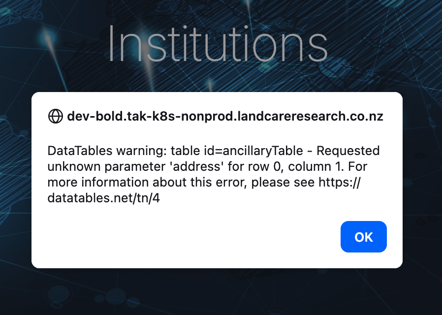

# Issue: DataTables "Requested unknown parameter 'address'" Error

**Status:** RESOLVED ✅  
**Date Identified:** 2026-01-28  
**Date Resolved:** 2026-01-28  
**Severity:** High (breaks institution page display, datasets not loading)

## Environment

| Environment | Status | Notes |
|-------------|--------|-------|
| Local Development | ✅ Works | Semicolons in URLs work directly to FastAPI |
| K8s Dev Deployment | ❌ Was Failing | Semicolons in URL query params being truncated by Traefik/proxy |

## Symptoms

On the institution page at `https://dev-bold.tak-k8s-nonprod.landcareresearch.co.nz/institution`:

1. DataTables error in console:
   
   ```
   DataTables warning: table id=institution_collection_table - Requested unknown parameter 'address' for row 0, column 1
   ```

2. The datasets page at `/recordset` shows "no matching records found"

3. Institution collection table fails to render properly

## Root Cause

**The data IS present in Couchbase and the API works correctly.** The issue was URL encoding of semicolons.

### The Problem

The `fields` parameter in API requests uses semicolons as separators:
```
/api/ancillary-set?collection=institutions&fields=name;address;specimens
```

However, semicolons (`;`) are treated as query parameter separators by some HTTP clients, proxies, and per HTTP specification. When the request passes through Traefik, the semicolon truncates the `fields` value.

**What the frontend sends:**
```
fields=name;address;specimens
```

**What the backend receives (after proxy):**
```
fields=name
```

This causes the API to only return the `name` field, and DataTables fails when trying to access the missing `address` field.

### Verification

Testing with curl:
```bash
# BROKEN - semicolons not encoded (only returns 'name')
curl "https://dev-bold.tak-k8s-nonprod.landcareresearch.co.nz/api/ancillary-set?collection=institutions&fields=name;address"
# Returns: [{"name":"..."},{"name":"..."}]  # NO address field!

# WORKS - semicolons URL-encoded (returns both fields)
curl "https://dev-bold.tak-k8s-nonprod.landcareresearch.co.nz/api/ancillary-set?collection=institutions&fields=name%3Baddress"
# Returns: [{"name":"...","address":"..."},...]  # Has address!
```

### Couchbase Verification

The data IS in Couchbase (verified with kubectl):
```
institutions:            10,321 documents ✅
datasets:                 4,544 documents ✅
institution_summaries:    1,595 documents ✅
```

## The Fix

Updated `src/templates/includes/ancillary_table.jinja2` to use `encodeURIComponent()`:

**Before:**
```javascript
ajax: {
    url: `/api/ancillary-set?collection=${collection}&fields=${fields}&min_records=${minRecords}`,
    dataSrc: dataSrc,
},
```

**After:**
```javascript
ajax: {
    url: `/api/ancillary-set?collection=${encodeURIComponent(collection)}&fields=${encodeURIComponent(fields)}&min_records=${minRecords}`,
    dataSrc: dataSrc,
},
```

## Deployment Steps

1. ✅ Fix applied to `src/templates/includes/ancillary_table.jinja2`
2. ⏳ Commit and push to `barcode-data-portal-mwlr` repository
3. ⏳ CI/CD builds and pushes new Docker image
4. ⏳ Update K8s deployment with new image tag (or wait for CI/CD)
5. ⏳ Verify fix on https://dev-bold.tak-k8s-nonprod.landcareresearch.co.nz/institution

## Files Modified

- `src/templates/includes/ancillary_table.jinja2` - Added `encodeURIComponent()` for URL parameters

## Investigation Notes

### Initial Hypothesis (Wrong)

Initially suspected the K8s init-job wasn't loading data into Couchbase properly. Improvements were made to the init-job script in `k8s-apps-config` with better error handling, but this wasn't the root cause.

### How It Was Found

1. Port-forwarded to FastAPI service directly and tested API - worked perfectly
2. Tested same API call through Traefik ingress - only `name` field returned
3. URL-encoded the semicolons - all fields returned correctly
4. Root cause: unencoded semicolons being interpreted as parameter separators

### Related Fix

The local `init.sh` script was previously failing due to trailing empty lines in `db_data/BCDM.jsonl`. This was fixed in commit `4598f02` ("Fix data issue with trailing lines"). This was a separate issue unrelated to the DataTables error.

## Related Issues

- [JS ChunkLoadError](../../open/js-chunk-loading-error/README.md) - Separate issue with Elementor JS loading from wrong domain

## Alternative: Could Traefik Have Been Fixed Instead?

**Q: Could we have fixed this in Traefik/Ingress instead of the app?**

**A: Technically maybe, but the app fix is the right choice.**

### Why Traefik Can't Easily Fix This

1. Traefik doesn't have a built-in middleware to disable semicolon parsing in query strings
2. The `replacePathRegex` middleware only works on paths, not query parameters
3. The parsing happens at the Go HTTP layer before Traefik middleware can intercept

### Why the App Fix is Better

1. **Correct behavior** - URL-encoding query parameters is the right thing to do per RFC 3986
2. **Portable** - Works across any proxy/ingress/CDN without infrastructure changes
3. **Simple** - One-line fix vs. complex middleware configuration
4. **Future-proof** - Semicolons as separators is deprecated (W3C removed this recommendation)
5. **Defensive** - The app shouldn't rely on infrastructure preserving special characters

The Traefik workaround would be a band-aid that might break with upgrades or when moving to different infrastructure.

## Lessons Learned

1. **Always URL-encode special characters in query parameters** - semicolons, spaces, ampersands, etc.
2. **Test API calls through the full proxy chain** - localhost may work while production fails
3. **The semicolon parameter separator** - RFC 3986 allows `;` as a parameter separator, so proxies may split on it
4. **Fix at the right layer** - App-level encoding is more robust than infrastructure workarounds
