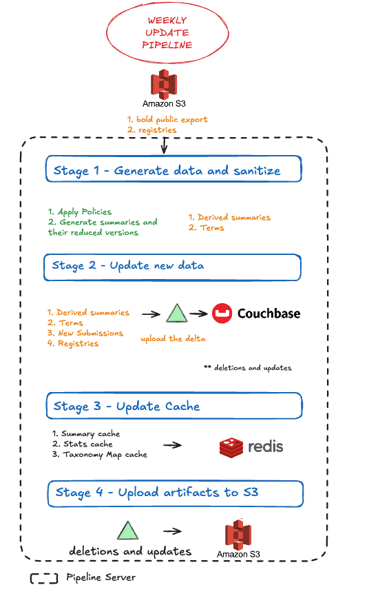
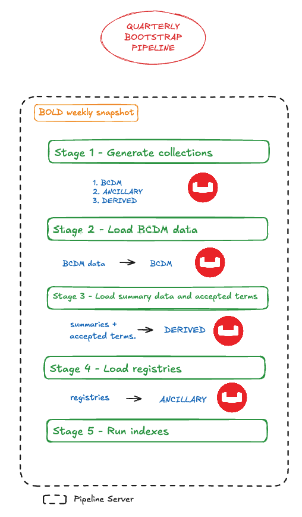

## What does the rebuild essentially do?
The rebuild pipelines uploads three types of BOLD data into Couchbase. 
A. BCDM data - The [Barcode Core Data Model](https://github.com/DNAdiversity/BCDM/tree/main) representation of data stored in BOLD databases and is the primary source of the upload data .

B. Registries supplement the BCDM record data by adding statistics and metadata that are not associated with records, but to entities that one or more records have in common.

C. Derived summaries and terms which are derived from the BCDM documents. Summaries aggregate data across multiple BCDM records in order to present a small, quick overview of queries to the datastore. Summaries are pre-generated and correspond to registry information about entities one or more records have in common, to improve the performance of delivering results to portal users.

The dataobject format for each of these data types is available in the .

These data is stored in Couchbase and is accessible via the Bold Public Data Portal interface.

The two types of data uploads pipelines are the Weekly and Quarterly pipelines briefly described in the table below.
Updates occur regularly to incorporate new BCDM records, as well as updates to any BCDM records already included.

** This pipeline assumes the knowledge of the underlying technology used in the pipeline, such as the datastores Couchbase, S3 and Redis.

## Rebuild Pipeline schedule
| Rebuild         | Time                             | Purpose/Action (Why?)
| --------        | -------                          | ------- 
| Weekly Update   | Every Thursday                   | Inclusion of recent data
| Quarterly Bootstrap      | Every Quarter     | Clean install of latest data in BOLD removing any stale or incorrect data

## 1. Weekly Update Pipeline

### Stages of the pipeline

#### Input Data Snapshot
A. BCDM data
The *latest* snapshot of BOLD records is generated every day and uploaded into the datalake in S3 Object Storage. 
This data contains candidate records which will be uploaded into CouchBase, namely
* new BCDM records that represent new BOLD data submissions
* older BCDM records to be updated with new information
* older BCDM records to be deleted  

B. Registries
1. primers
2. datasets
3. institutions
4. geopols
5. barcode clusters
6. taxonomies

For the rebuild pipeline, this snapshot and accompanying registries are downloaded from S3 onto the machine deploying the upsert pipeline task.

#### Stage 1: Generate Data and Sanitize
* This stage deals with the creation of data summaries and accepted terms from the new weekly data snapshot.
* Using the data snapshots and registries, a summary is generated per registry. Additional summaries that are relatively small for example, the country summary and bin summary are re-generated on the fly from the singlepane snapshot.

The summaries generated are :
1. Primer Summaries
2. Dataset summaries
3. Institution summaries
4. Taxonomy and geopol summmary
5. Country summaries
6. Sequence Run Site summaries
7. BIN summaries
8. Taxonomy Summaries

#### Stage 2: Update data into Couchbase
* New data submissions are uploaded into the *BCDM* (Barcode Core Data Model) collection in Couchbase.
* Registries are uploaded into the *ANCILLARY* collection in Couchbase.
* Summaries and accepted terms are uploaded into a the *DERIVED* collection in Couchbase.

#### Stage 3: Update Cache using Redis
This step creates a summary cache, a taxonomy mapping cache and a statistics cache that is written into Redis.

#### Stage 4: Upload Artifacts to S3
This stage uploads the a list of the BOLD records that have been updated, which is generated during Stage 2, into Amazon S3. This helps in recods keeping for any update reversals and for audit trails.

 
 
 

---

 
 
 

## 2. Quarterly Bootstrap pipeline

Quarterly data rebuilds are executed every quarter to parse through the entirety of the data snapshot and refresh the datastore, removing any stale or incorrect data.

### Stages of the pipeline
This pipeline is a grounds-up full data load into empty Couchbase collections. Data from BOLD can be made available for public consumption over its lifetime on BOLD. Public data are exported from BOLD's database following the BCDM specification as a snapshot in time.

### Stage 1 : Create collections in Couchbase
Before we load the data , three main collection groups are created :
A. BCDM - contains the BCDM data described above.
B. ANCILLARY - contains the registries listed above.
C. DERIVED - contains the summaries and accepted terms.

### Stage 2 : Load primary documents
This step loads the BCDM records into the BCDM collection in Couchbase.
### Stage 3 : Load summaries and terms
This step loads the summaries and accepted terms into the Derived collection in Couchbase.
### Stage 4 : Load ancillary documents
This step loads the registries and accepted terms into the Ancillary collection in Couchbase.
### Stage 5 : Generate Indexes
This step runs indexes defined in the repository.
